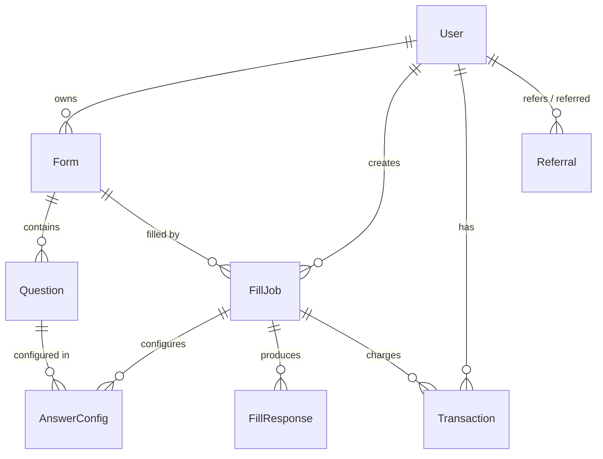

<div align="center">

# 🚀 FillForm

**Nền tảng tự động điền Google Form thông minh, nhanh chóng và chính xác.**

[](https://nextjs.org/)
[](https://react.dev/)
[](https://typescriptlang.org/)
[](https://tailwindcss.com/)
[](https://prisma.io/)

[Demo](#demo) · [Tính năng](#-tính-năng) · [Cài đặt](#-cài-đặt) · [Kiến trúc](#-kiến-trúc) · [API](#-api-endpoints) · [Đóng góp](#-đóng-góp)

</div>

---

## 📋 Giới thiệu

**FillForm** là nền tảng SaaS giúp người dùng tự động điền Google Form hàng loạt với khả năng tùy chỉnh cao. Ứng dụng tích hợp **AI (Gemini)** để sinh câu trả lời thông minh, hỗ trợ cấu hình tỷ lệ phân bổ cho từng câu hỏi, và phân tán response theo thời gian để mô phỏng hành vi thực tế.

### Tại sao chọn FillForm?

| Vấn đề | Giải pháp của FillForm |
|--------|----------------------|
| Điền form thủ công tốn thời gian | ⚡ Tự động hóa hoàn toàn, xử lý hàng trăm response |
| Dữ liệu trông giả tạo, thiếu tự nhiên | 🤖 AI sinh câu trả lời đa dạng, realistic |
| Cần phân bổ tỷ lệ theo yêu cầu | 📊 Cấu hình tỷ lệ chính xác cho từng option |
| Response đồng loạt gây nghi ngờ | 🕐 Phân tán thời gian response tự động |

---

## ✨ Tính năng

### 🎯 Core Features

- **📝 Google Form Parser** — Tự động phân tích và trích xuất cấu trúc form từ URL
- **🤖 AI-Powered Answers** — Tích hợp Google Gemini API sinh câu trả lời thông minh
- **📊 Ratio Configuration** — Cấu hình tỷ lệ phân bổ cho từng câu hỏi (VD: 60% Option A, 40% Option B)
- **🕐 Spread Distribution** — Phân tán response theo khoảng thời gian, mô phỏng hành vi người thật
- **📋 Data Import** — Điền form theo bộ dữ liệu có sẵn (CSV/JSON)

### 🛡️ Platform Features

- **🔐 Authentication** — Hệ thống đăng nhập/đăng ký bảo mật với NextAuth.js
- **💰 Credit System** — Quản lý credits cho mỗi lượt điền form
- **👥 Referral Program** — Chương trình giới thiệu bạn bè nhận hoa hồng
- **📈 Dashboard** — Bảng điều khiển trực quan theo dõi tiến độ realtime
- **🔧 Admin Panel** — Quản trị hệ thống, quản lý người dùng và chiến dịch

---

## 🛠 Tech Stack

```
Frontend          Backend           Database          AI & Tools
─────────         ──────────        ─────────         ──────────
Next.js 16        API Routes        Prisma ORM 7      Google Gemini
React 19          NextAuth.js 5     SQLite             Cheerio
TypeScript 5      bcryptjs          (production:       Zustand
Tailwind CSS 4    JWT               upgradable)        React Query
Lucide Icons                                           Playwright
```

---

## 🏗 Kiến trúc

```
src/
├── app/
│   ├── (admin)/            # 🔧 Admin panel routes
│   ├── (auth)/             # 🔐 Login / Register
│   ├── (dashboard)/        # 📊 User dashboard
│   ├── (marketing)/        # 🏠 Landing page & service pages
│   │   ├── page.tsx        #     Homepage
│   │   ├── contact/        #     Liên hệ
│   │   ├── service/        #     Dịch vụ
│   │   └── dien-form-*/    #     Các trang dịch vụ chi tiết
│   └── api/
│       ├── admin/          # 🔧 Admin APIs
│       ├── ai/             # 🤖 AI generation endpoint
│       ├── auth/           # 🔐 Authentication
│       ├── fill-jobs/      # 📝 Fill job management
│       └── forms/          # 📋 Form CRUD & parsing
├── components/
│   └── marketing/          # 🎨 Landing page components
├── lib/                    # 🧩 Utilities & shared logic
└── types/                  # 📐 TypeScript definitions
```

---

## 🚀 Cài đặt

### Yêu cầu

- **Node.js** >= 18
- **npm**, **yarn**, **pnpm**, hoặc **bun**
- **Google Gemini API Key** (cho tính năng AI)

### 1. Clone repository

```bash
git clone https://github.com/<your-username>/fillform-clone.git
cd fillform-clone
```

### 2. Cài đặt dependencies

```bash
npm install
```

### 3. Cấu hình environment

Tạo file `.env` trong thư mục gốc:

```env
# Authentication
AUTH_SECRET="your-auth-secret-key"
NEXTAUTH_URL="http://localhost:3000"

# AI
GEMINI_API_KEY="your-gemini-api-key"

# JWT
JWT_SECRET="your-jwt-secret"
```

### 4. Khởi tạo database

```bash
npx prisma generate
npx prisma db push
npx ts-node prisma/seed.ts   # (optional) Seed data mẫu
```

### 5. Chạy development server

```bash
npm run dev
```

Mở [http://localhost:3000](http://localhost:3000) để xem kết quả.

---

## 🗄 Database Schema

Ứng dụng sử dụng **Prisma ORM** với các model chính:



---

## 🔌 API Endpoints

| Method | Endpoint | Mô tả |
|--------|----------|-------|
| `POST` | `/api/auth/*` | Xác thực (NextAuth.js) |
| `GET/POST` | `/api/forms` | CRUD Google Forms |
| `POST` | `/api/forms/parse` | Phân tích cấu trúc form từ URL |
| `GET/POST` | `/api/fill-jobs` | Quản lý fill jobs |
| `POST` | `/api/ai/generate` | Sinh câu trả lời bằng AI |
| `GET` | `/api/admin/*` | Admin management APIs |

---

## 📜 Scripts

| Command | Mô tả |
|---------|-------|
| `npm run dev` | Chạy development server |
| `npm run build` | Build production bundle |
| `npm run start` | Chạy production server |
| `npm run lint` | Kiểm tra lỗi ESLint |

---

## 🤝 Đóng góp

Mọi đóng góp đều được chào đón! Hãy tạo **Issue** hoặc **Pull Request** nếu bạn muốn cải thiện dự án.

1. Fork repository
2. Tạo branch mới (`git checkout -b feature/amazing-feature`)
3. Commit thay đổi (`git commit -m 'Add amazing feature'`)
4. Push lên branch (`git push origin feature/amazing-feature`)
5. Tạo Pull Request

---

## 📄 License

Dự án này được phát hành dưới giấy phép [MIT](LICENSE).

---

<div align="center">

**Được xây dựng với ❤️ bằng Next.js & Gemini AI**

</div>
